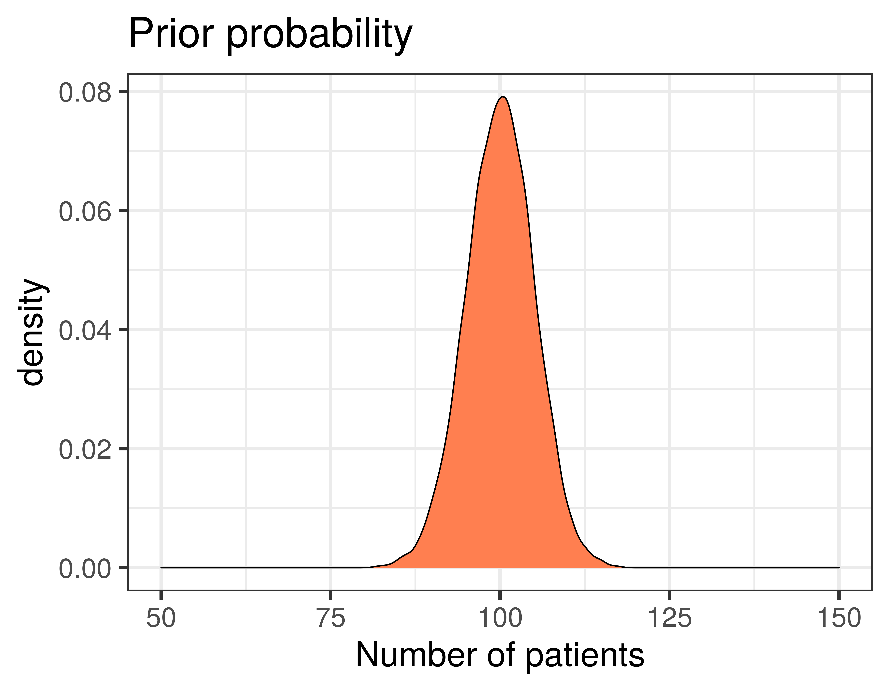
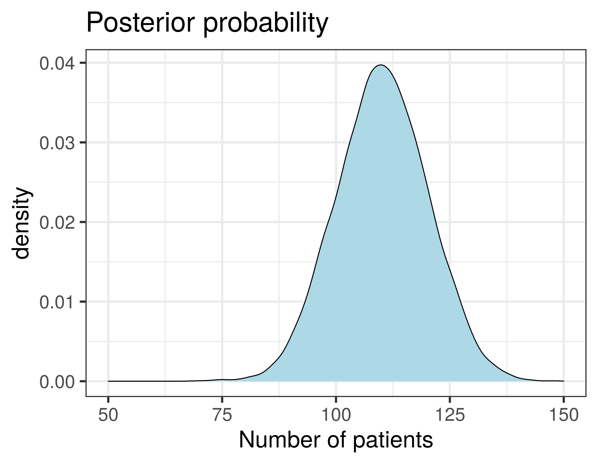
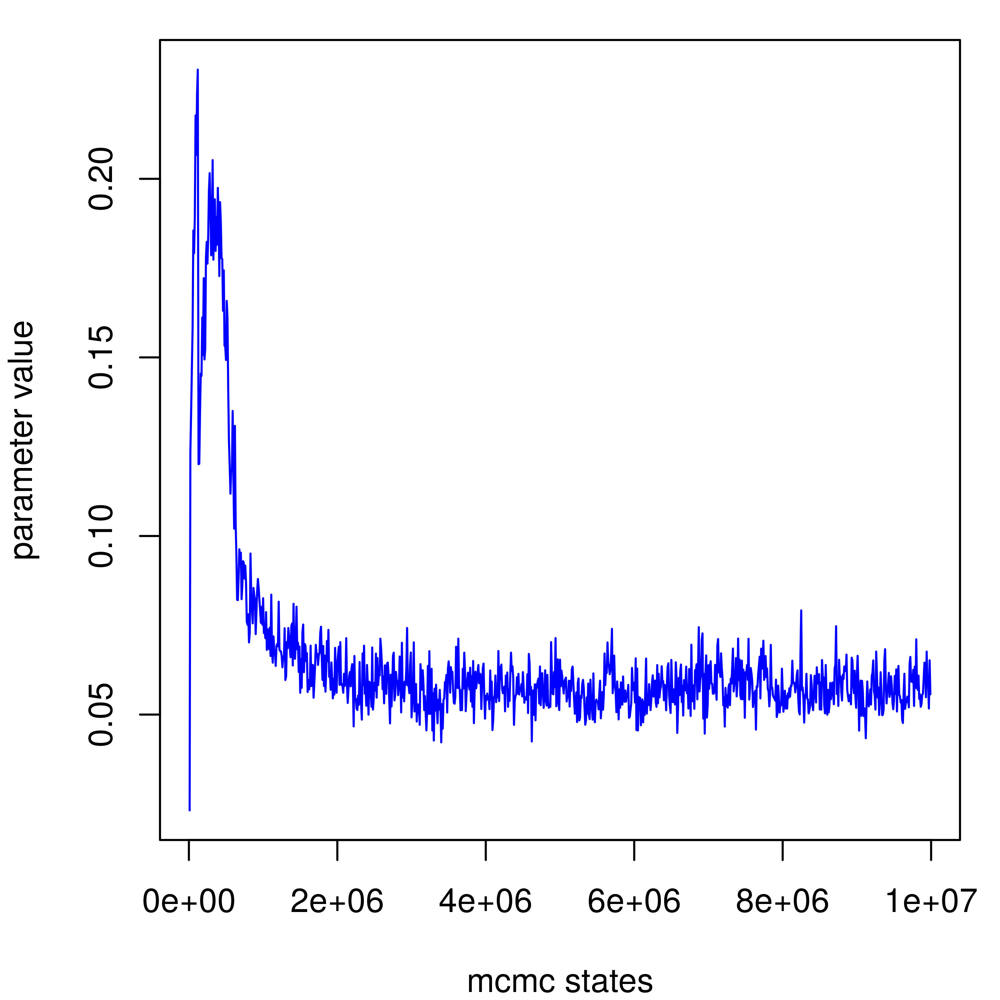
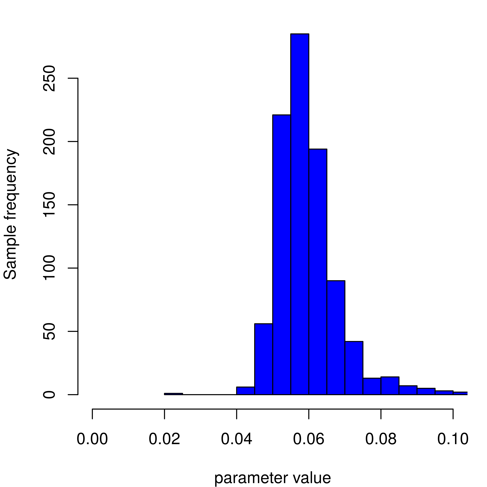

<!-- adding bold and italic options -->

## Bayesian phylogenetics

- Bayesian statistics
- Phylogenetic models
- Prior and posterior distributions
- MCMC sampling
- Interpreting results

--- &vcenter

## Introductory video 1

https://www.youtube.com/watch?v=IqMzYTOf6H0&ab_channel=DataCamp

--- &vcenter

## Introductory video 2

https://www.youtube.com/watch?v=FmzgKXV53-w&ab_channel=DataCamp

--- .class #id

## The key points

- Bayesian statistics provide a way of describing our prior knowledge of a system as a probability
- We can then update this `prior probability` by observing some data
- The updated probability is called the `posterior probability`
- Prior and posterior probabilities can also take the form of `probability distributions`
- These allow us to describe a range of probabilites for different values
- More flexible than a single fixed probability value

--- &twocol bg:white

## Probability distributions

- Imagine you want to predict the number of patients arriving at a hospital in the next week
- You have information from previous weeks that allow you to make an estimate
- **But on the Monday...**

*** =left

--- &twocol bg:white

## Probability distributions

- Imagine you want to predict the number of patients arriving at a hospital in the next week
- You have information from previous weeks that allow you to make an estimate
- **But on the Monday, more patients arrive that you were expecting!**

*** =left

*** =right

--- .segue .dark 

## How does this work with phylogenetics?

--- .class #id

## Bayesian phylogenetic analysis

- The phylogeny is the evolutionary history of the sequences
- We need a `model` of how the sequences evolve
- The model has `parameters` that we can assign prior probabilites to
- The tree `topology`, for example, is a parameter
- We can then observe some data, in the form of a `sequence alignment`
- And calculate the `posterior probabilities` of our model parameters

--- .class #id

## An example phylogenetic model

Parameter|Prior
---------|------
Substitution rate|estimated rate
Tr/Tv ratio|estimated ratio
Base frequencies|estimated frequencies A,T,G,C
Topology|A set of tree topologies
Branch lengths|A set of branch lengths
Population size|A number of individuals

--- .segue .dark 

## Can you compute all those possibilities?

--- .class #id

## Example: tree topology

- We would like to calculate posterior probabilities for all possible tree topologies
- Then select the ones with highest probability

>- How many rooted tree topologies are there?
  + 3 sequences = 3 trees
  + 4 sequences = 15 trees
  + 5 sequences = 105 trees
  + 10 sequences = 34,459,425 trees
  + 53 sequences = 2.7E+80 (> total atoms in universe)

>- **Computing all possible topologies for modest number of sequences is computationally impossible**

--- &twocol

## Markov chain Monte Carlo (MCMC) sampling

*** =left

1. Start at a tree
2. Jump to a nearby tree
3. Compare posterior probabilities
4. New tree > previous tree
  + accept
5. New tree < previous tree
  + accept proportional to difference
6. Repeat (x millions)

*** =right

--- .class #id

## MCMC sampling in practise

>- The initial moves are likely to have low probability
>- This is called `burn in`
>- We rapidly move to a set of parameter values with similarly high probability
>- This is called `convergence` or `stationarity`
>- Sampling the chain at convergence approximates the true posterior distribution
>- This is called the `posterior sample`
>- Since the MCMC steps are not independent, we take 1,000s between every sample
>- And we can verify sufficient sampling using the `effective sample size`

--- &twocol bg:white

## MCMC sampling in practise

Graphically it looks like this

*** =left

*** =right

--- .segue .dark 

## But aren't we also collecting thousands of trees?

--- &twocol bg:white

## Summarising the posterior sample of trees

*** =right

- The *actual* result of the analysis is thousands of trees
- Typically pick one good one, and annotate with clade posterior probabilities
- Other parameters like branch lengths are averaged across posterior sample

*** =left

--- .class #id

## Bayesian phylogenetics

- Bayesian statistics
- Phylogenetic models
- Prior and posterior distributions
- MCMC sampling
- Interpreting results

--- &thankyou

## Next time

**Molecular dating**
